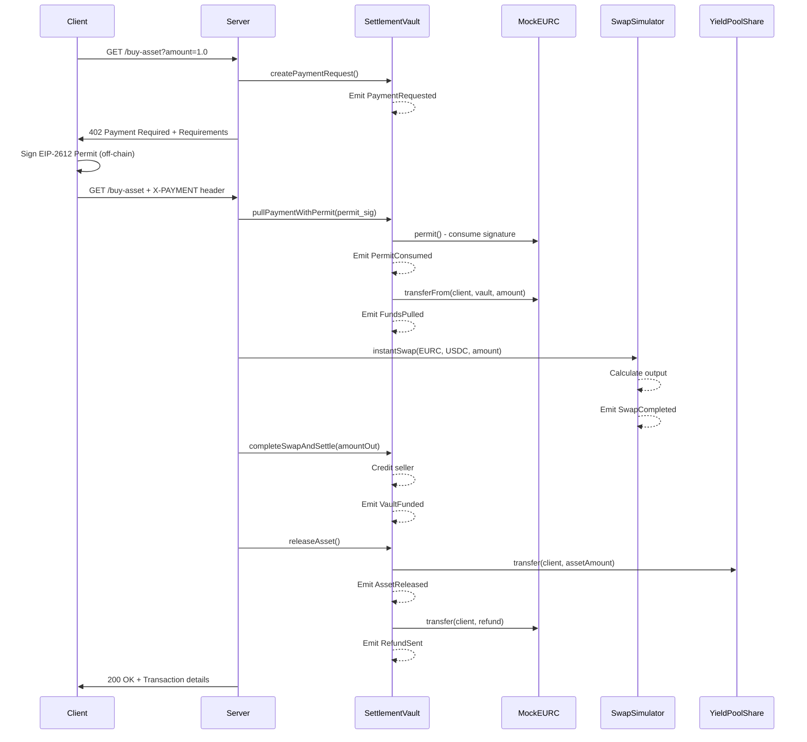

# x402 OTC API - Architecture Documentation

This document provides a detailed technical overview of the x402 OTC API system architecture.

---

## Table of Contents

1. [System Overview](#system-overview)
2. [Smart Contracts](#smart-contracts)
3. [Protocol Flow](#protocol-flow)
4. [EIP-2612 Integration](#eip-2612-integration)
5. [Event System](#event-system)
6. [Python Components](#python-components)
7. [Security Considerations](#security-considerations)

---

## System Overview

The x402 OTC API is a complete system for selling on-chain assets via HTTP with gasless payment approvals.

### Key Components

```
┌─────────────────────────────────────────────────────────────┐
│                       Client Layer                          │
│  - HTTP Client                                              │
│  - EIP-2612 Signer                                          │
│  - EUR/USD Rate Query                                       │
└─────────────────────────────────────────────────────────────┘
                            ↓ HTTP 402 / X-PAYMENT
┌─────────────────────────────────────────────────────────────┐
│                       Server Layer                          │
│  - Flask HTTP Server                                        │
│  - x402 Payment Handler                                     │
│  - Web3 Transaction Manager                                 │
└─────────────────────────────────────────────────────────────┘
                            ↓ Transactions
┌─────────────────────────────────────────────────────────────┐
│                    Blockchain Layer                         │
│  ┌─────────────────┐  ┌─────────────────┐                  │
│  │ SettlementVault │  │  SwapSimulator  │                  │
│  │  - Order mgmt   │  │  - EURC→USDC    │                  │
│  │  - Permit pull  │  │  - Rate config  │                  │
│  │  - Settlement   │  └─────────────────┘                  │
│  │  - Asset release│                                        │
│  └─────────────────┘  ┌─────────────────┐                  │
│                       │ YieldPoolShare  │                  │
│  ┌─────────────────┐  │  - ERC-20 asset │                  │
│  │   MockEURC      │  └─────────────────┘                  │
│  │  - EIP-2612     │                                        │
│  └─────────────────┘  ┌─────────────────┐                  │
│                       │   MockUSDC      │                  │
│  ┌─────────────────┐  │  - Settlement   │                  │
│  │  Event Tracker  │  └─────────────────┘                  │
│  │  - Real-time    │                                        │
│  │  - Historical   │                                        │
│  └─────────────────┘                                        │
└─────────────────────────────────────────────────────────────┘
```

---

## Smart Contracts

### 1. YieldPoolShare (Asset Token)

**Purpose:** Represents the on-chain asset being sold

**Key Features:**
- Standard ERC-20 token
- 18 decimals
- Owner-controlled minting/burning
- Used as inventory for OTC sales

**Interface:**
```solidity
function mint(address to, uint256 amount) external onlyOwner
function burn(address from, uint256 amount) external onlyOwner
function balanceOf(address account) external view returns (uint256)
```

---

### 2. SettlementVault (Core Logic)

**Purpose:** Orchestrates the entire x402 payment and settlement flow

**Key Features:**
- Order lifecycle management
- EIP-2612 permit consumption
- Fund pulling with transferFrom
- Swap coordination
- Asset escrow and release
- Refund handling

**State Machine:**
```
None → Requested → FundsPulled → SwapCompleted → Settled → AssetReleased
```

**Key Functions:**

#### createPaymentRequest
```solidity
function createPaymentRequest(
    bytes32 orderId,
    address client,
    address seller,
    address assetToken,
    uint256 assetAmount,
    address settlementToken,
    uint256 settlementAmount,
    uint256 deadline
) external onlyOwner
```
Creates a new order and emits `PaymentRequested` event.

#### pullPaymentWithPermit
```solidity
function pullPaymentWithPermit(
    bytes32 orderId,
    address paymentToken,
    uint256 amount,
    uint256 deadline,
    uint8 v,
    bytes32 r,
    bytes32 s
) external nonReentrant onlyOwner
```
Consumes EIP-2612 permit and pulls funds from client.

#### completeSwapAndSettle
```solidity
function completeSwapAndSettle(
    bytes32 orderId,
    uint256 amountOut
) external nonReentrant onlyOwner
```
Completes swap and prepares for asset release.

#### releaseAsset
```solidity
function releaseAsset(bytes32 orderId) external nonReentrant onlyOwner
```
Transfers asset to client and sends refund if applicable.

---

### 3. SwapSimulator (DEX Simulation)

**Purpose:** Simulates EURC → USDC conversion without real liquidity pool

**Key Features:**
- Configurable exchange rates
- Instant or delayed fulfillment
- Event emission for tracking
- Rate oracle pattern

**Exchange Rate Formula:**
```
amountOut = amountIn × rate / (10^rateDecimals)
```

**Example:**
- Rate: 1.05e18 (with 18 decimals)
- Input: 100 EURC (100e6)
- Output: 100 × 1.05e18 / 1e18 = 105 USDC (105e6)

---

## Protocol Flow

### Complete Transaction Sequence



---

## EIP-2612 Integration

### What is EIP-2612?

EIP-2612 adds `permit()` function to ERC-20 tokens, enabling gasless approvals through off-chain signatures.

### Traditional Flow (requires 2 transactions):
```
1. User: approve(spender, amount) ← costs gas
2. Spender: transferFrom(user, dest, amount)
```

### EIP-2612 Flow (1 transaction):
```
1. User: Sign permit message (off-chain, no gas)
2. Spender: permit() + transferFrom() in same tx
```

### Implementation in x402 OTC API

#### Client Side (Python)
```python
# Create EIP-712 typed data
permit_data = {
    "types": {
        "EIP712Domain": [...],
        "Permit": [...]
    },
    "domain": {
        "name": "Mock Euro Coin",
        "version": "1",
        "chainId": 80002,
        "verifyingContract": mockEURC_address
    },
    "message": {
        "owner": client_address,
        "spender": vault_address,
        "value": amount,
        "nonce": nonce,
        "deadline": deadline
    }
}

# Sign (off-chain, no gas)
signed = account.sign_message(encode_typed_data(permit_data))
```

#### Server Side (Solidity)
```solidity
// Consume permit
IERC20Permit(paymentToken).permit(
    client,
    address(this),
    amount,
    deadline,
    v, r, s
);

// Pull funds (permit already consumed)
IERC20(paymentToken).transferFrom(client, address(this), amount);
```

### Benefits

1. **Gasless for Client:** No gas spent on approval
2. **Atomic:** Approval + transfer in single transaction
3. **No Front-running:** Signature is single-use with nonce
4. **Better UX:** One signature instead of two transactions

---

## Event System

### Event Flow

All major operations emit events for observability:

```
PaymentRequested
    ↓
PermitConsumed
    ↓
FundsPulled
    ↓
SwapCompleted
    ↓
VaultFunded
    ↓
AssetReleased
    ↓
RefundSent (if applicable)
```

### Event Definitions

#### PaymentRequested
```solidity
event PaymentRequested(
    bytes32 indexed orderId,
    address indexed client,
    address paymentToken,
    uint256 requiredAmount,
    uint256 deadline
);
```

#### PermitConsumed
```solidity
event PermitConsumed(
    bytes32 indexed orderId,
    address indexed client,
    address token,
    uint256 amount
);
```

#### FundsPulled
```solidity
event FundsPulled(
    bytes32 indexed orderId,
    address indexed client,
    address token,
    uint256 amount
);
```

#### SwapCompleted
```solidity
event SwapCompleted(
    bytes32 indexed orderId,
    uint256 amountIn,
    uint256 amountOut,
    uint256 surplus
);
```

#### AssetReleased
```solidity
event AssetReleased(
    bytes32 indexed orderId,
    address indexed client,
    address asset,
    uint256 amount
);
```

---

## Python Components

### Server (Flask)

**Responsibilities:**
- HTTP endpoint management
- x402 response generation
- EIP-2612 signature handling
- Transaction orchestration

**Key Routes:**
- `GET /buy-asset` - Main OTC endpoint
- `GET /status/<order_id>` - Order status
- `GET /health` - Health check

### Client

**Responsibilities:**
- HTTP 402 handling
- EIP-2612 permit signing
- Exchange rate queries
- Payment submission

**Flow:**
1. Request asset
2. Receive 402 with requirements
3. Calculate max payment
4. Sign permit
5. Retry with X-PAYMENT header

### Event Tracker

**Responsibilities:**
- Real-time event monitoring
- Historical event queries
- Progress visualization

**Features:**
- Poll-based event watching
- Beautiful CLI output
- Order status tracking
- Multi-contract monitoring

---

## Security Considerations

### Smart Contract Security

1. **Reentrancy Protection**
   - All state-changing functions use `nonReentrant` modifier
   - Follow checks-effects-interactions pattern

2. **Access Control**
   - Owner-only functions for critical operations
   - Role-based access in MockTokenBase

3. **Deadline Enforcement**
   - All permits have deadlines
   - Orders have expiration times

4. **Order State Machine**
   - Strict state transitions
   - Status checks on all operations

### Server Security

1. **Signature Verification**
   - Permit signatures verified on-chain
   - Nonce prevents replay attacks

2. **Rate Limiting**
   - TODO: Implement rate limiting on endpoints
   - Prevent DOS attacks

3. **Input Validation**
   - All inputs validated before processing
   - Proper error handling

### Client Security

1. **Private Key Management**
   - Keys from environment variables
   - Never logged or exposed

2. **Slippage Protection**
   - Client adds buffer to payment amount
   - Refund mechanism for surplus

---

## Extensibility

### Adding New Asset Types

1. Deploy new ERC-20 token
2. Mint tokens to vault
3. Configure pricing in server
4. No contract changes needed

### Real DEX Integration

Replace SwapSimulator with:
- Uniswap V3 Router
- Uniswap V4 Hooks
- Curve Finance
- Any DEX with quote interface

### Oracle Integration

Add Chainlink price feeds:
```solidity
function getExchangeRate() external view returns (uint256) {
    (, int256 price,,,) = priceFeed.latestRoundData();
    return uint256(price);
}
```

---

## Performance

### Gas Costs (estimated)

| Operation | Gas Cost |
|-----------|----------|
| createPaymentRequest | ~150k |
| pullPaymentWithPermit | ~120k |
| completeSwapAndSettle | ~100k |
| releaseAsset | ~80k |
| **Total per order** | **~450k** |

### Optimization Opportunities

1. Batch multiple orders
2. Use EIP-1559 for gas pricing
3. Implement meta-transactions
4. Add layer 2 support

---

## Deployment Checklist

- [ ] Deploy MockEURC and MockUSDC (P01)
- [ ] Deploy YieldPoolShare
- [ ] Deploy SwapSimulator
- [ ] Deploy SettlementVault
- [ ] Configure SwapSimulator exchange rate
- [ ] Link SwapSimulator to SettlementVault
- [ ] Mint YPS tokens to SettlementVault
- [ ] Test with small amounts first
- [ ] Monitor events with tracker
- [ ] Document contract addresses

---

## Testing Strategy

### Unit Tests
- Individual contract functions
- State transitions
- Access control
- Error conditions

### Integration Tests
- Full order lifecycle
- EIP-2612 permit flow
- Swap simulation
- Refund logic

### End-to-End Tests
- Complete HTTP 402 flow
- Python client integration
- Event emission verification

---

## Future Enhancements

1. **Multi-chain Support**
   - Deploy to multiple networks
   - Cross-chain asset bridging

2. **Advanced Order Types**
   - Limit orders
   - Recurring purchases
   - Scheduled releases

3. **Liquidity Pools**
   - Real DEX integration
   - Dynamic pricing
   - Slippage protection

4. **Governance**
   - DAO for parameter updates
   - Community-driven pricing

5. **Analytics**
   - Order volume tracking
   - Price history
   - User statistics

---

## Resources

- [EIP-2612 Specification](https://eips.ethereum.org/EIPS/eip-2612)
- [EIP-712 Typed Data](https://eips.ethereum.org/EIPS/eip-712)
- [OpenZeppelin Contracts](https://docs.openzeppelin.com/contracts/)
- [Foundry Book](https://book.getfoundry.sh/)
- [Web3.py Documentation](https://web3py.readthedocs.io/)

---

**For questions or contributions, see the main [README](README.md).**

